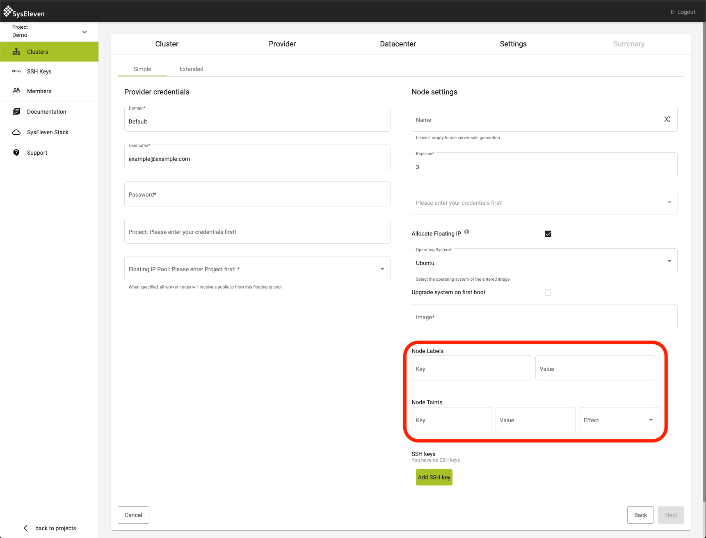

[Taints and Tolerations](https://kubernetes.io/docs/concepts/configuration/taint-and-toleration/) are used in Kubernetes to mark single nodes for specific use-cases (taints) and allowing pods to be scheduled on such nodes (tolerations).
While it is possible to taint single nodes manually we do not recommend to do so when using your MetaKube cluster, since each update of the nodes will recreate them, and they will loose their taints. When creating a Node Deployment we provide a setting, that all nodes get created with Labels and/or Taints.



Newly created machines will then automatically be tainted and/or labelled with the values you chose. In a typical setup one would set a Taint with NoSchedule Effect and a matching label on the node (e.g. Key `dedicated` and Value `web`). Deployments which shall run on these dedicated nodes then need two settings: The toleration to be _allowed_ to be scheduled on these nodes, and a nodeSelector to be _restricted_ to only these nodes:

```yaml
apiVersion: extensions/v1beta1
kind: Deployment
metadata:
  name: web
spec:
  [...]
  template:
    [...]
    spec:
      tolerations:
      - operator: Equal
        effect: NoSchedule
        key: dedicated
        value: web
      [...]
      nodeSelector:
        dedicated: web
      [...]
```
