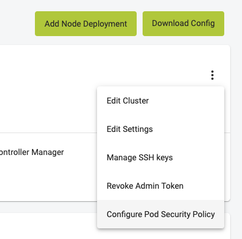

By default Pod Security Policies are deactivated in MetaKube clusters, but you can optionally activate them on the cluster detail page in the dashboard. Pod Security Policies allow you to specify fine-grained authorization settings for Pod creation and updates.

! If you activate Pod Security Policy, a lot of Pod specifications, Operators and Helm charts will not work out of the box anymore. Only activate it if you know what you are doing.

## Configuring Pod Security Policy

You can activate Pod Security Polices on the cluster details page under "Configure Pod Security Policy".



## How does it work

The Kubernetes documentation has a detailed article about [Pod Security Policies](https://kubernetes.io/docs/concepts/policy/pod-security-policy/). You should read this before activating the feature.

### Example

After activating Pod Security Policies, every Pod needs a Policy in order to be started or updated.

If you create a new deployment:

```bash
cat <<'EOF' | kubectl apply --namespace default -f -
kind: Deployment
apiVersion: apps/v1
metadata:
  name: nginx-hello
spec:
  replicas: 3
  selector:
    matchLabels:
      app: nginx-hello
  template:
    metadata:
      labels:
        app: nginx-hello
    spec:
      containers:
      - name: nginx-hello
        image: nginxdemos/hello:0.2
        livenessProbe:
          httpGet:
            path: /
            port: 80
          timeoutSeconds: 1
        readinessProbe:
          httpGet:
            path: /
            port: 80
          timeoutSeconds: 1
EOF
```

You can see that the Deployment and a subsequent ReplicaSet were created, but the pods can not be scheduled:

```bash
$ kubectl describe replicaset nginx-hello-f4cb7b776 --namespace default
Name:           nginx-hello-f4cb7b776
Namespace:      default
Selector:       app=nginx-hello,pod-template-hash=f4cb7b776
Labels:         app=nginx-hello
                pod-template-hash=f4cb7b776
Annotations:    deployment.kubernetes.io/desired-replicas: 3
                deployment.kubernetes.io/max-replicas: 4
                deployment.kubernetes.io/revision: 1
Controlled By:  Deployment/nginx-hello
Replicas:       0 current / 3 desired
Pods Status:    0 Running / 0 Waiting / 0 Succeeded / 0 Failed
Pod Template:
  Labels:  app=nginx-hello
           pod-template-hash=f4cb7b776
  Containers:
   nginx-hello:
    Image:        nginxdemos/hello:0.2
    Port:         <none>
    Host Port:    <none>
    Liveness:     http-get http://:80/ delay=0s timeout=1s period=10s #success=1 #failure=3
    Readiness:    http-get http://:80/ delay=0s timeout=1s period=10s #success=1 #failure=3
    Environment:  <none>
    Mounts:       <none>
  Volumes:        <none>
Conditions:
  Type             Status  Reason
  ----             ------  ------
  ReplicaFailure   True    FailedCreate
Events:
  Type     Reason        Age                From                   Message
  ----     ------        ----               ----                   -------
  Warning  FailedCreate  1s (x15 over 83s)  replicaset-controller  Error creating: pods "nginx-hello-f4cb7b776-" is forbidden: unable to validate against any pod security policy: []
```

To make the Pods scheduable, you have to create a PodSecurityPolicy and bind it to the ServiceAccount running this Pod with a Role and RoleBinding or ClusterRole and ClusterRoleBinding. The following example creates a very restricted PodSecurityPolicy and binds it to all ServiceAccounts in the default namespace:

```bash
cat <<'EOF' | kubectl apply -f -
apiVersion: policy/v1beta1
kind: PodSecurityPolicy
metadata:
  name: psp-restricted
  annotations:
    seccomp.security.alpha.kubernetes.io/allowedProfileNames: 'docker/default,runtime/default'
    apparmor.security.beta.kubernetes.io/allowedProfileNames: 'runtime/default'
    seccomp.security.alpha.kubernetes.io/defaultProfileName:  'runtime/default'
    apparmor.security.beta.kubernetes.io/defaultProfileName:  'runtime/default'
spec:
  privileged: false
  # Required to prevent escalations to root.
  allowPrivilegeEscalation: false
  # This is redundant with non-root + disallow privilege escalation,
  # but we can provide it for defense in depth.
  requiredDropCapabilities:
    - ALL
  # Allow core volume types.
  volumes:
    - 'configMap'
    - 'emptyDir'
    - 'projected'
    - 'secret'
    - 'downwardAPI'
    # Assume that persistentVolumes set up by the cluster admin are safe to use.
    - 'persistentVolumeClaim'
  hostNetwork: false
  hostIPC: false
  hostPID: false
  runAsUser:
    # Require the container to run without root privileges.
    rule: 'MustRunAsNonRoot'
  seLinux:
    # This policy assumes the nodes are using AppArmor rather than SELinux.
    rule: 'RunAsAny'
  supplementalGroups:
    rule: 'MustRunAs'
    ranges:
      # Forbid adding the root group.
      - min: 1
        max: 65535
  fsGroup:
    rule: 'MustRunAs'
    ranges:
      # Forbid adding the root group.
      - min: 1
        max: 65535
  readOnlyRootFilesystem: false
---
apiVersion: rbac.authorization.k8s.io/v1
kind: Role
metadata:
  name: psp:default
  namespace: default
rules:
- apiGroups: ['policy']
  resources: ['podsecuritypolicies']
  verbs:     ['use']
  resourceNames:
  - psp-restricted
---
apiVersion: rbac.authorization.k8s.io/v1
kind: RoleBinding
metadata:
  name: psp:default
  namespace: default
roleRef:
  kind: Role
  name: psp:default
  apiGroup: rbac.authorization.k8s.io
subjects:
# Authorize all service accounts
- kind: Group
  apiGroup: rbac.authorization.k8s.io
  name: system:serviceaccounts
EOF
```

To force Kubernetes to retry creating the Pods directly instead of waiting for the back-off interval, you can delete the existing ReplicaSet. A new ReplicaSet will be automatically created because of the Deployment:

```bash
kubectl delete replicaset nginx-hello-f4cb7b776 --namespace default
```

The pods can now be created:

```bash
$ kubectl get pods --namespace default
NAME                          READY   STATUS              RESTARTS   AGE
nginx-hello-f4cb7b776-4wgf7   0/1     ContainerCreating   0          8s
nginx-hello-f4cb7b776-mgcwn   0/1     ContainerCreating   0          8s
nginx-hello-f4cb7b776-tnsl6   0/1     ContainerCreating   0          8s
```
