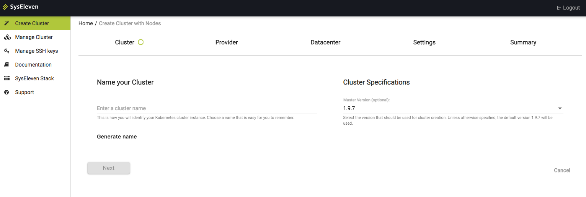
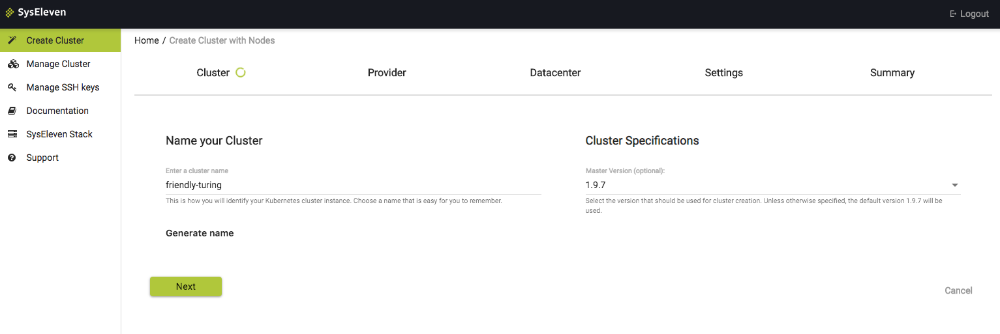
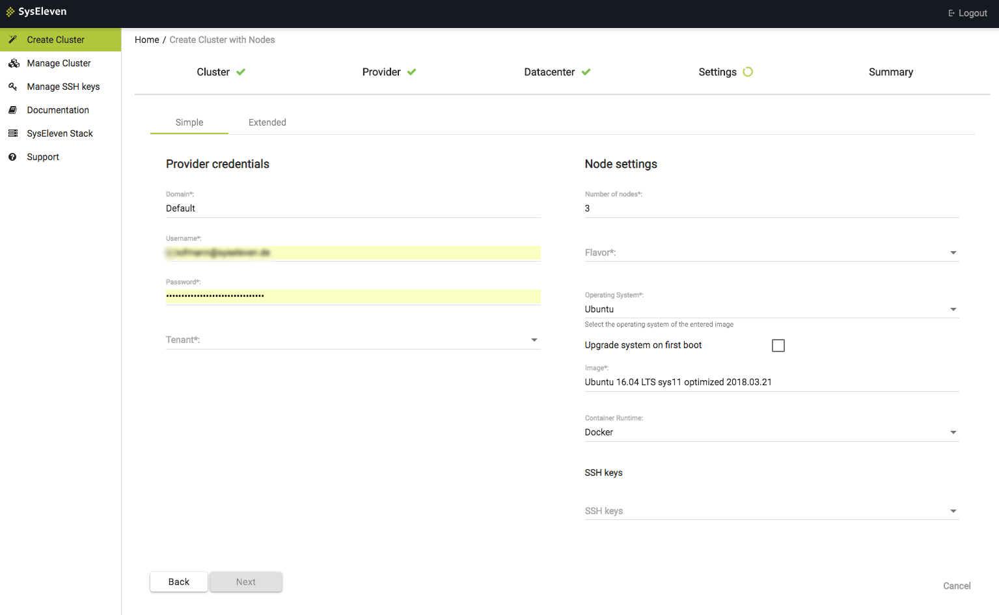
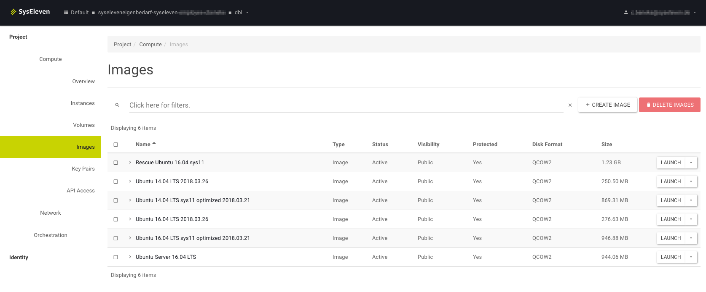

## Place to live

To create a new cluster open the MetaKube dashboard and select the menu entry `Create Cluster`.

Start by choosing a name,




the provider \(on writing this document only SysEleven Stack is supported\)


and the region, where the cluster shall live/


## Create the cluster

In the next step of the installer, enter the domain-name and your SysEleven Stack credentials into the `Provide credentials` tab.



And then choose the tenant where you want to create the cluster in in the drop-down.


As node settings, we recommend at least 3 nodes sized `m1.small` or bigger.


You can also choose the Operating System you want to use for your worker nodes;


A default image tested and maintained by SysEleven is automatically chosen for the nodes, but you can also enter any image available
to you in SysEleven Stack. To get a list of current base images, navigate to `Project -> Compute -> Images` in the SysEleven Stack dashbaord.



Make sure to enter the exact name of the image you want to run on your machines,
as listed in the images tab of the SysEleven stack dashboard.
  
The chosen SSH key will be used for authentication as user `apiserver` on all worker nodes.


When you click on next, you will see a summary and the cluster creation will start if you confirm. You will be forwarded to the creation overview on confirmation, to see your new cluster being deployed.


After all master components are ready, you cluster will create the configured amount of worker nodes in your SysEleven Stack tenant.
Fully created nodes will be marked with a green dot, pending ones with a yellow circle. You should [download the kubeconfig](/tutorials/download-the-kubeconfig) now,
to be able to use `kubectl` with your cluster.

After all nodes are created you can use `kubectl` to view and check the status of the created nodes:

```bash
$ kubectl get nodes
NAME                          STATUS    ROLES     AGE       VERSION
kubermatic-w9tk8cmw62-22wgv   Ready     <none>    1m        v1.9.6
kubermatic-w9tk8cmw62-58pd6   Ready     <none>    1m        v1.9.6
kubermatic-w9tk8cmw62-hm5vl   Ready     <none>    1m        v1.9.6
```