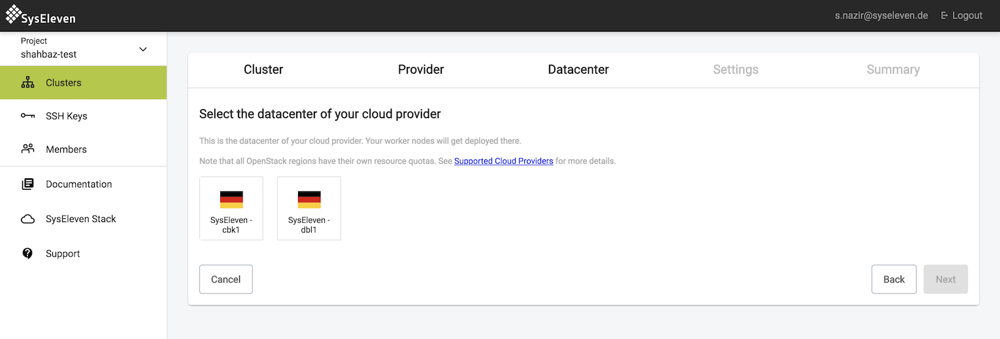
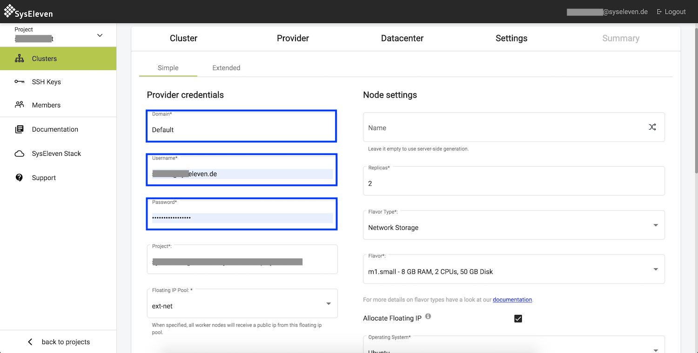
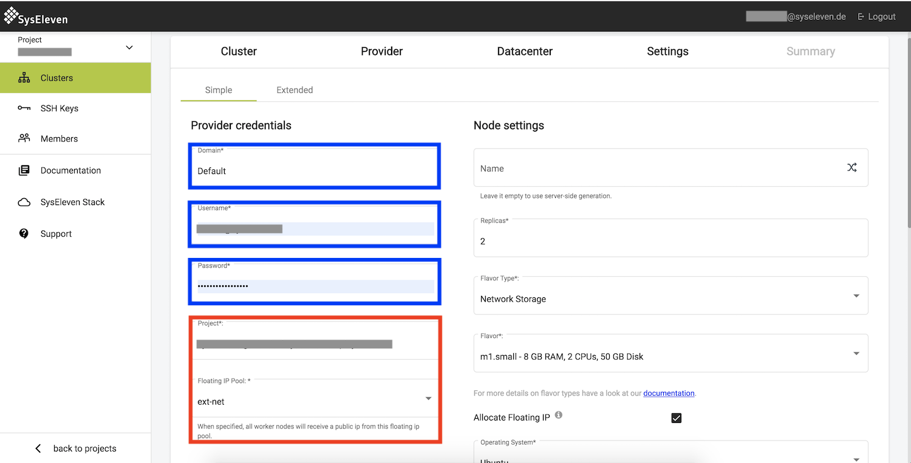
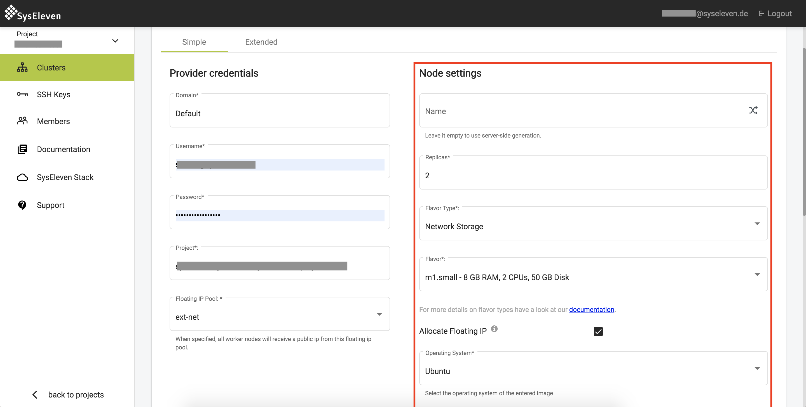
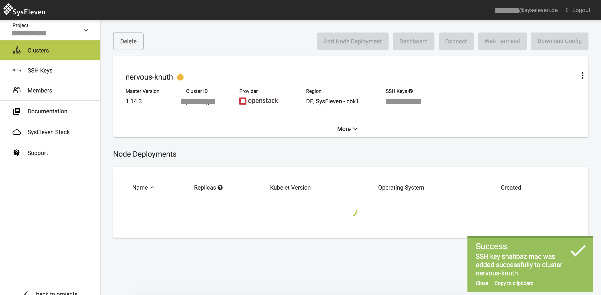

[Place to live](#place-to-live)
[Create the cluster](#create-the-cluster)

## Place to live

To create a new cluster, open the MetaKube dashboard and select the menu entry `Create Cluster`.
Start by choosing a name


the provider (at the time of writing, only the SysEleven Stack is supported)


and the region where the cluster shall live



## Create the cluster

In the next step of the installer, enter the domain name and your SysEleven Stack credentials into the `Provide credentials` tab



Then choose the tenant where you want to create the cluster from the drop-down list



For node settings we recommend at least 3 nodes sized `m1.small` or bigger. For an overview of the possible node flavors see the [SysEleven Stack documentation](https://doc.syselevenstack.com/en/faq/compute/).



You can also choose the operating system you want to use for your worker nodes


A default image tested and maintained by SysEleven is automatically chosen for the nodes, but you can also enter any image available to you in SysEleven Stack. To get a list of current base images, navigate to `Project -> Compute -> Images` in the SysEleven Stack dashbaord


Make sure to enter the exact name of the image you want to run on your machines, as listed in the images tab of the SysEleven stack dashboard.  
The chosen SSH key will be used for authentication as user `apiserver` on all worker nodes.


When you click on next, you will see a summary and the cluster creation will start after you confirm. You will then be forwarded to the cluster creation page where you can view the cluster creation process.




After all of the master components are ready, your cluster will create the configured number of worker nodes in your SysEleven Stack tenant. Fully created nodes will be marked with a green dot, pending ones with a yellow circle. You may [download the kubeconfig](../06.download-the-kubeconfig/default.en.md) now to be able to use `kubectl` with your cluster.
After all nodes are created you can use `kubectl` to view and check the status of the created nodes

```bash
$ kubectl get nodes
NAME                          STATUS    ROLES     AGE       VERSION
kubermatic-w9tk8cmw62-22wgv   Ready     <none>    1m        v1.9.6
kubermatic-w9tk8cmw62-58pd6   Ready     <none>    1m        v1.9.6
kubermatic-w9tk8cmw62-hm5vl   Ready     <none>    1m        v1.9.6
```
