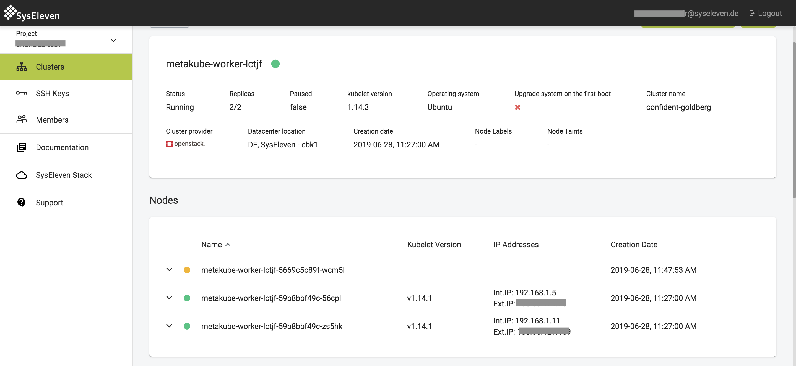

## Add new node deployment

To add a new node deployment navigate to your cluster view and click on the `Add Node Deployment` button:

In the popup you can then choose the number of nodes (replicas), kubelet version, flavor, etc for your newly created nodedeployment. All nodes created in this nodedeployment will have the chosen settings.

## Edit the node deployment

To add or delete a worker node you can easily edit the node deployment in your cluster. Navigate to the cluster overview and click on the node deployment you want to change. You will then see the node deployment overview. In this overview click on the `Edit Node Deployment` button:

In the popup you can now in- or decrease the number of, as well as the kubelet version, operating system, used image etc of the worker nodes which are managed by this node deployment:

On Openstack, MetaKube will also detect automatically when newer images are available for the node deployment's operating system, and allow you to update with one click.

Save your changes and wait for MetaKube to add or delete your extra worker node(s):

The nodes will be upgraded in a rolling upgrade, which means it does a one-by-one upgrade of all machines. Therefore it will create a new node and when this node is ready will drain and delete an old node and so on until all nodes are updated.
