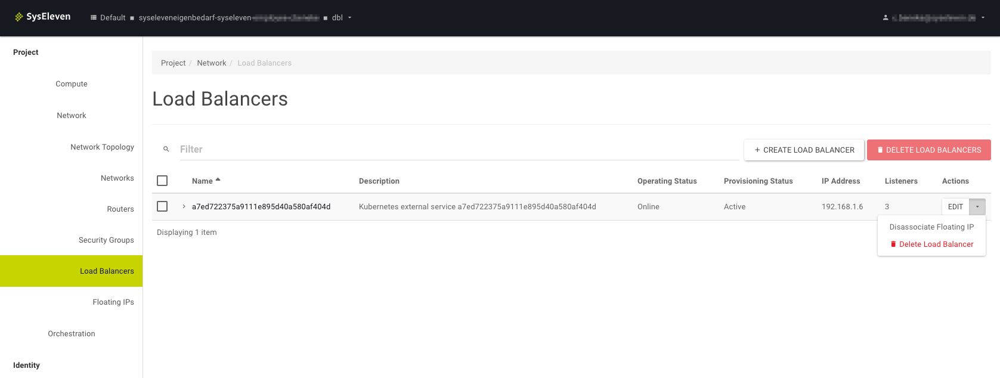
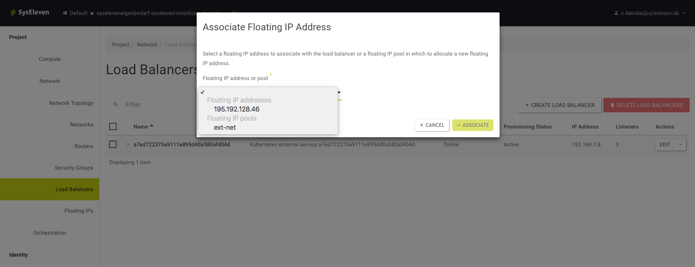

## Security group

When binding an external IP to the Load Balancer it is by default not directly reachable from the outside.
In order to make it accessible you have to add a security group to the SysEleven Stack Load Balancer Resource so
it can be reached from the outside, and to your cluster nodes so they can be reached by (at least) the
load balancer.

## Install the Openstack Client

You need to have `python-openstackclient` and `python-octaviaclient` installed on your workstation \(which includes the `neutron` binary\).

See the [SysEleven Stack documentation](https://doc.syselevenstack.com/en/tutorials/openstack-cli/) for more information on how to install these.

## Configuring the LB Security Group

Start by creating the LBaaS security group and allow the needed ports:

```bash
# create LBaaS Security Group, the name is arbitrary
$ openstack security group create lbaas

# define Security Group Rules (e.g. open tcp port 80,443 and icmp)
$ openstack security group rule create --ingress --protocol tcp --dst-port 80:80   --remote-ip 0.0.0.0/0 lbaas
$ openstack security group rule create --ingress --protocol tcp --dst-port 443:443 --remote-ip 0.0.0.0/0 lbaas
```

Afterwards you can bind the resource to the created Load Balancer:

```bash
# list defined LBaaS resources
$ neutron lbaas-loadbalancer-list
+--------------------------------------+-------+-------------+---------------------+----------+
| id                                   | name  | vip_address | provisioning_status | provider |
+--------------------------------------+-------+-------------+---------------------+----------+
| ed3ac6d2-561b-4411-9dc7-bf3e3e5eaad4 | lb    | 192.168.1.7 | ACTIVE              | midonet  |
+--------------------------------------+-------+-------------+---------------------+----------+

# show LBaas resource, to get the vip_port_id
$ neutron lbaas-loadbalancer-show ed3ac6d2-561b-4411-9dc7-bf3e3e5eaad4
+---------------------+--------------------------------------------------------------+
| Field               | Value                                                        |
+---------------------+--------------------------------------------------------------+
|         ...         |                             ...                              |
| vip_address         | 192.168.1.7                                                  |
| vip_port_id         | 6ac4637a-dcc5-42fa-a363-ccca26c98bb2                         |
| vip_subnet_id       | baf5bfca-9036-4683-aab5-e1963e737410                         |
+---------------------+--------------------------------------------------------------+

# bind security group to used port (vip_port_id)
$ openstack port set --security-group lbaas 6ac4637a-dcc5-42fa-a363-ccca26c98bb2
```

## Configuring the Node Security Group

The previous step exposed the load balancer's external IP and ports to the outside world.

What's missing is that you'll have to make your cluster nodes accessible to the LB as well, so it can successfully
forward TCP traffic to them. The nodes will receive the traffic on the service NodePorts belonging to the
loadbalancer service. In the example setup from [Create a Load Balancer](create-loadbalancer.md), those were
ports 31228 and 30279. Kubernetes always chooses these ports to lie within the Kubernetes node port range, 30000...32767.

You can either expose the entire node port range or just the specific NodePorts that the service is accessible on.
In this example, we'll expose the entire range because it won't ever change and thus will be easier to manage when
setting this up manually.

```bash
# create Node Security Group, the name is arbitrary
$ openstack security group create nodeports

# define Security Group Rules
$ openstack security group rule create --ingress --protocol tcp --dst-port 30000:32767 --remote-ip 0.0.0.0/0 nodeports

# add the security group to the cluster security group attached to all nodes
$ openstack server add security group kubermatic-9jchzq5h7m nodeports
```

## Change the external IP

If you want to change the external IP of the Load Balancer, you can associate a floating IP to the Load Balancer in the SysEleven Stack dashboard.
A newly created Load Balancer already has an IP associated, to disassociate it open the menu `Project -> Network -> Load Balancers` and click
on `Disassociate Floating IP`:



Afterwards you can associate another IP by clicking on `Associate Floating IP` in the same menu. This will trigger a popup,
where you can either select an already existing floating IP or a floating IP pool:



## Troubleshooting

### I created a Load Balancer, but can't reach the application

This can have multiple reasons. Typical problems are:

* _Your application is not reachable_. Try to use `kubectl port-forward $PODNAME 8080:80` \(port might differ\) and check, if you can reach your application on Port 80.

* _The required port is not defined in the service manifest_. Check if the service lists all required ports with `kubectl get svc`.

* _The service port is not reachable._ Check, if you can reach the service port on any of your worker nodes. Therefor you need to open the port \(temporarily\) in the cluster security group.

* _The Load Balancer can't reach the worker nodes_. Make sure, that your cluster security group has opened the port range
  `30000 - 32767` for the internal network `192.168.0.0/16`.
