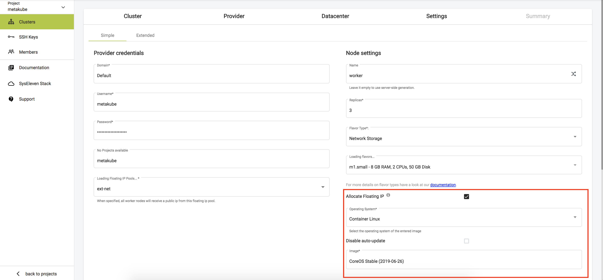

To use a custom image for your metakube clusters, you need to upload an image of a [supported operating system](../../02.Documentation/05.supported-operating-systems/default.en.md) to SysEleven Stack and choose it in the workernode creation afterwards.

[Upload to SysEleven Stack](#upload-to-syseleven-stack) (alternatively via
[CLI](#upload-to-syseleven-stack-via-cli))
[Choose in cluster creation](#choose-in-cluster-creation)

## Upload to SysEleven Stack

Log into the [SysEleven Stack dashboard](https://dashboard.cloud.syseleven.net/) and navigate to `Project -> Compute -> Images`. In the top right corner you can find the `Create Image` button to upload a new image


When you click on this button the image creation dialog will open. Enter a name, choose the image file and format and click on `Create Image`


When the upload is finished the image will be visible in your images Tab.

## Upload to SysEleven Stack via CLI

Alternatively to the upload via GUI, you can upload a new image to SysEleven Stack via CLI. You need to have the `python-openstackclient` installed, which includes the CLI tool `glance`.

You can simply upload it to the cloud with the following command

``` bash
glance image-create \
  --name <imageName> \
  --container-format bare \
  --disk-format qcow2 \
  --file <path/to/image>
```

## Choose in cluster creation

In the [cluster creation process](../02.create-a-cluster/default.en.md) you will be asked, which image and operating system you want to use. Choose the correct OS and enter the name you chose for your image before. The cluster will then be created with your custom image


